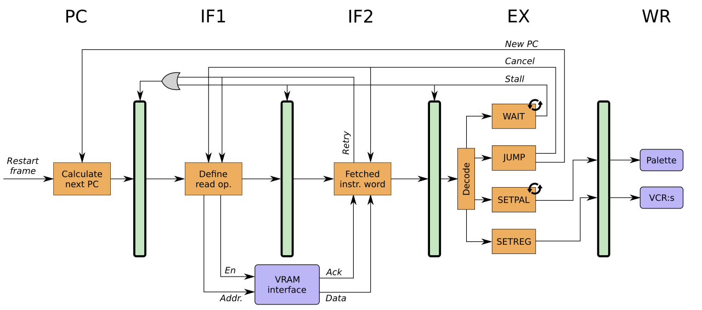

# Video logic

## Key features

* Multiple pixel color modes: 1, 2, 4 and 8-bit palette modes and 16- and 32-bit full color modes.
* Two video layers with programmabler blending (8-bit alpha channel).
* Programmable raster-synchronized control processor.
* Independly and freely configurable vertical and horizontal resolutions (from 1x1 to 1920x1080).
* Hardware dithering for systems with less than 24 bpp output signals.

## Layers

There are two video layers. Each layer consists of:

* A video control program processor.
* A pixel pipeline.
* A palette.
* A video control register file.

Video layer 1 is the bottom (background) layer, and video layer 2 is the top
(foreground) layer.

## Video control program

A video control program (VCP) is a sequence of video control commands. See
the [VCP examples](../tools/vcpas/examples) for what a VCP can look like.

The only way to alter the color palette or any of the video control registers
is via a VCP.

The program is started during the vertical blanking interval, and continues to
exectue until the next vertical blanking interval.

To mark the end of a program, issue a `WAIT` command that waits for a line
that will never be displayed (e.g. `WAIT 32767`).

## VCP execution and timing

The video control program processor (VCPP) of the MC1 is a simple processor
with five pipeline stages, running at pixel clock frequency (e.g. when the
MC1 is configured for 1920x1080@60Hz native resolution, the pipeline can
execute up to 148.5 Mop/s):

## Video control commands

Each video control command (VCC) is 32 bits wide.

The four most significant bits give the command, according to:

| Code (dec) | Command | Description                                     |
|------------|---------|-------------------------------------------------|
| 0          | JMP     | Jump to a target address                        |
| 1          | JSR     | Jump to a subroutine (push return address)      |
| 2          | RTS     | Return from a subroutine (pop return address)   |
| 3          | NOP     | No operation                                    |
| 4          | WAITX   | Wait until the given raster column is reached   |
| 5          | WAITY   | Wait until the given raster row is reached      |
| 6          | SETPAL  | Set the palette                                 |
| 8          | SETREG  | Set the value of a video control register       |

### JMP

The JMP command is encoded as follows:

| Bits  | Description            |
|-------|------------------------|
| 31-28 | 0000                   |
| 27-24 | (unused)               |
|  23-0 | Target address         |

The JMP jumps to the given target address (without affecting the internal call stack).

### JSR

The JSR command is encoded as follows:

| Bits  | Description            |
|-------|------------------------|
| 31-28 | 0001                   |
| 27-24 | (unused)               |
|  23-0 | Target address         |

The JSR command pushes the address to the next instruction onto the internal call stack, and then jumps to the given target address.

Note: The internal call stack is implemented as a circular buffer with 16 entries.

### RTS

The RTS command is encoded as follows:

| Bits  | Description            |
|-------|------------------------|
| 31-28 | 0010                   |
|  27-0 | (unused)               |

The RTS command pops an instruction address from the top of the internal call stack, and jumps to that address.

Note: Since the stack is never reset, issuing an RTS command without a matching JSR command will result in undefined behaviour.

### NOP

The NOP command is encoded as follows:

| Bits  | Description            |
|-------|------------------------|
| 31-28 | 0011                   |
|  27-0 | (unused)               |

The NOP instruction does nothing (except advancing the program pointer to the next instruction).

### WAITX

The WAITX command is encoded as follows:

| Bits  | Description                          |
|-------|--------------------------------------|
| 31-28 | 0100                                 |
| 27-16 | (unused)                             |
|  15-0 | Raster column number (-32768..32767) |

The command waits until the specified column is reached. If the specified column has already passed, the command will wait for the same column in the next raster line.

### WAITY

The WAITY command is encoded as follows:

| Bits  | Description                       |
|-------|-----------------------------------|
| 31-28 | 0101                              |
| 27-16 | (unused)                          |
|  15-0 | Raster row number (-32768..32767) |

The command waits until the specified row is reached. If the specified row has already passed, the command will wait until the end of the frame.

### SETPAL

The SETPAL command is encoded as follows:

| Bits  | Description                      |
|-------|----------------------------------|
| 31-28 | 0110                             |
| 27-16 | (unused)                         |
|  15-8 | First palette entry (0-255)      |
|   7-0 | Number of entries - 1, N (0-255) |

After the SETPAL command, N+1 number of RGBA8888 (ABGR32) color values follow in the VCP stream.

### SETREG

The SETREG command is encoded as follows:

| Bits  | Description            |
|-------|------------------------|
| 31-28 | 1000                   |
| 27-24 | Register number (0-15) |
|  23-0 | 24-bit value           |

The SETREG commands sets the given register (VCR) to the specified 24-bit value.

## Video control registers

Each video control register (VCR) is 24 bits wide.

| Reg | Name | Description |
|-----|------|-------------|
| 0   | ADDR | Row start address (word address = byte address / 4) Default: 0x000000 |
| 1   | XOFFS | X coordinate offset (signed fixed point, 8.16 bits) Default: 0x000000 |
| 2   | XINCR | X coordinate increment (signed fixed point, 8.16 bits) Default: 0x004000 (0.25) |
| 3   | HSTRT | Horizontal screen start position Default: 0 |
| 4   | HSTOP | Horizontal screen stop position Default: 0 |
| 5   | CMODE |  |
|     | Bits 0-2 | Color mode: &nbsp;0 = RGBA8888 (32 bpp) &nbsp;1 = RGBA5551 (16 bpp) &nbsp;2 = PAL8 (8 bpp, default) &nbsp;3 = PAL4 (4 bpp) &nbsp;4 = PAL2 (2 bpp) &nbsp;5 = PAL1 (1 bpp) |
| 6   | RMODE |  |
|     | Bits 0-7 | Blend method:&nbsp;(1) &nbsp;Default: 0x35 &nbsp;(see below) |
|     | Bits 8-9 | Dither method:&nbsp;(2) &nbsp;0 = no dithering &nbsp;1 = white noise dithering (default) |

(1) Only used by layer 2.

(2) Only used by layer 1.

## Pixel pipeline

The pixel pipeline uses the configuration given by the video control registers to read data from VRAM and convert it to 24-bit RGB pixel values.

## Blending

The two layers are blended together using the blend mode given by bits 0-7 in the RMODE register of video layer 2.

The final color, (R, G, B), is calculated as:

* R = clamp(s1*R1 + s2*R2)
* G = clamp(s1*G1 + s2*G2)
* B = clamp(s1*B1 + s2*B2)

...where:

* Rk = Red color component from layer *k*
* Gk = Green color component from layer *k*
* Bk = Blue color component from layer *k*
* Ak = Alpha value (0.0 - 1.0) from layer *k*
* sk = Scale factor for color components in layer *k*

The eight-bit blend mode of the RMODE register is composed of two four-bit scale factor selectors:

| Bits 7-4 | Bits 3-0 |
| --- | --- |
| s2 selector | s1 selector |

Each selector is decoded as follows:

| sk selector | sk |
| --- | --- |
| 0 | 1 |
| 1 | -1 |
| 2 | A1 |
| 3 | A2 |
| 4 | 1 - A1 |
| 5 | 1 - A2 |

## Dithering

As a final step the 24-bit RGB color is dithered to the resolution that is supported by the target hardware. For instance if the video output of a device is 12-bit VGA (4 bits per color component), the color will be dithered from 24 bits to 12 bits.

The dithering method is selected with bits 8-9 in the RMODE register of video layer 1.
